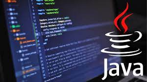

# Introducción

## ¿Qué es un programa?

Según Wikipedia "Un programa informático o programa de computadora es una [secuencia de instrucciones](https://es.wikipedia.org/wiki/Conjunto\_de\_instrucciones), escritas para realizar una tarea específica en una [computadora](https://es.wikipedia.org/wiki/Computadora)"​

La mayor parte de programas tiene una o varias entradas de datos: datos introducidos por el usuarios, datos leídos de un fichero...

También suelen producir algún tipo de efecto de salida: mostrar una información en pantalla, escribir un fichero, escribir en una base de datos, etc..

Los programas son ejecutables y pueden estar escritos en uno o varios lenguajes de programación.

## Lenguajes de programación

Según Wikipedia "Un lenguaje de programación es un [lenguaje ](https://es.wikipedia.org/wiki/Lenguaje\_formal)[formal](https://es.wikipedia.org/wiki/Lenguaje\_formal) (o artificial, es decir, un lenguaje con reglas gramaticales bien definidas) que le proporciona a una persona, en este caso el programador, la capacidad de escribir (o programar) una serie de [instrucciones](https://es.wikipedia.org/wiki/Instrucci%C3%B3n\_\(inform%C3%A1tica\)) o secuencias de órdenes en forma de [algoritmos](https://es.wikipedia.org/wiki/Algoritmo) con el fin de controlar el comportamiento físico o lógico de una [computadora](https://es.wikipedia.org/wiki/Computadora), de manera que se puedan obtener diversas clases de datos o ejecutar determinadas tareas"​

### Sintaxis y semántica

Las reglas que marcan como se debe expresar la lógica de un programa vienen definidas por la sintaxis y la semántica del lenguaje de programación​

La **sintaxis** define qué secuencias de texto son válidas en un lenguaje de programación​

La **semántica** de un lenguaje define restricciones que aseguren que las secuencias sintácticas tienen un significado en el lenguaje​

### Clasificación de los lenguajes de programación

Los lenguajes de programación se pueden clasificar de múltiples formas, dependiendo de qué característica estemos analizando.

#### Lenguajes interpretados y compilados​

Interpretados son aquellos lenguajes que pueden ejecutar directamente el código fuente​

Compilados son aquellos lenguajes que, para ser ejecutados, requieren la conversión del código fuente a código objeto a través de un proceso denominado compilación​

La ventaja de los lenguajes interpretados es que son más portables, es decir, se pueden ejecutar en diferentes arquitecturas sin modificarlos.​

La ventaja de los lenguajes compilados es que en el proceso de compilación se puede comprobar la corrección del programa y aplicar optimizaciones sobre el código, son por lo general más eficientes que los compilados.​

#### Paradigmas de programación

Según Wikipedia "Un paradigma de programación consiste en un método para llevar a cabo cómputos y la forma en la que deben estructurarse y organizarse las tareas que debe realizar un programa"​

Cada lenguaje de programación está vinculado a uno o varios paradigmas de programación​

Algunos de los paradigmas más utilizados en la actualidad son:

* Orientado a objetos: Java, C#, C++, Kotlin
* Imperativo: C, C++, Java
* Funcional: Scala, Kotlin, Haskell, JavaScript
* Programación lógica: PROLOG
* Declarativo: SQL
* Dirigido por eventos: NodeJS

## Java

<figure><figcaption></figcaption></figure>

Java es el lenguaje de programación con el que aprenderemos a programar durante el curso. Algunas de sus principales características son:

* Es uno de los lenguajes más usados en el mundo​
* Fue creado en 1996 por Sun Microsystems​
* Se trata de un lenguaje compilado​
* **Multiplataforma**: gracias a que se ejecuta sobre la máquina virtual de Java (JVM)​
* Multiparadigma: **orientado a objetos**, genérico, imperativo...​
* Fuertemente y **estáticamente** **tipado**

### Java Development Kit (JDK)

Java Development Kit (JDK) es un [software](https://es.wikipedia.org/wiki/Software) que provee [herramientas de desarrollo](https://es.wikipedia.org/wiki/Kit\_de\_desarrollo\_de\_software) para la creación de [programas](https://es.wikipedia.org/wiki/Programa\_inform%C3%A1tico) en [Java](https://es.wikipedia.org/wiki/Java\_\(lenguaje\_de\_programaci%C3%B3n\)).

Los programas escritos en Java deben ser compilados para, posteriormente, poder ser ejecutados. El comando `javac`, incluido en el JDK, sirve para compilar un programa.

Una vez compilado un fichero .java obtenemos un programa compilado almacenado en un fichero .class que ya podemos ejecutar. Para ejecutar un programa Java compilado se usa el comando `java` Ejecución con el comando java​

### IntelliJ Idea

IntelliJ IDEA es un [entorno de desarrollo integrado](https://es.wikipedia.org/wiki/Entorno\_de\_desarrollo\_integrado) (IDE) para el desarrollo de programas informáticos. Es desarrollado por JetBrains (anteriormente conocido como IntelliJ), y está disponible en dos ediciones: edición para la comunidad​ y edición comercial.

En este curso utilizaremos la versión Community que se puede descargar [aquí](https://www.jetbrains.com/idea/download/).

\\
