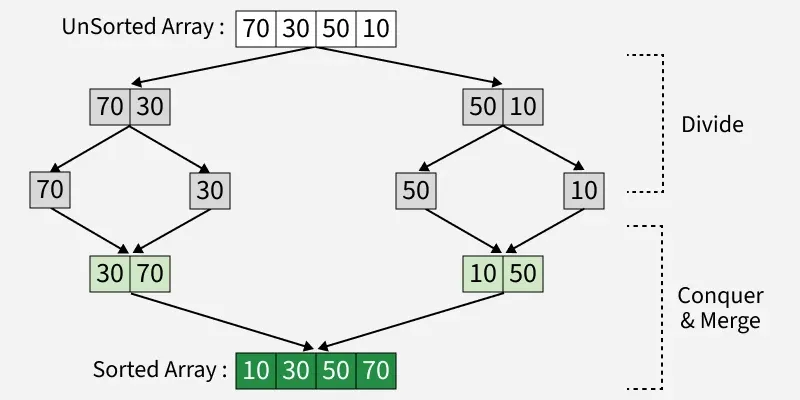

# Merge sort


&#x20;

Es un algoritmo de ordenación basado en **divide y vencerás**.

Comparado con lo que has visto hasta ahora, _merge sort_ marca un salto cualitativo. Ordenar un millón de elementos con la burbuja requiere aproximadamente medio billón de comparaciones; _merge sort_ lo hace con unos veinte millones, unas 25 000 veces menos.

**Requisitos previos**

Para entender este algoritmo hace falta:

* Manejar con soltura la **recursión**.
* Entender la **técnica de dos punteros** (la operación central del algoritmo la utiliza).
* Tener clara la idea de **complejidad** O(n) vs O(n log n) vs O(n²).

Si alguno de estos tres conceptos aún no está asentado, conviene repasarlo antes de seguir.

### 1. La idea central: divide y vencerás

Recordemos las tres fases de divide y vencerás:

1. **Dividir** el problema en subproblemas más pequeños del mismo tipo.
2. **Vencer** (resolver) cada subproblema, normalmente de forma recursiva. Cuando los subproblemas son triviales, resolvemos directamente: ese es el **caso base**.
3. **Combinar** las soluciones de los subproblemas para obtener la solución del problema original.

Aplicado a la ordenación:

1. **Dividir:** partimos el array en dos mitades.
2. **Vencer:** ordenamos cada mitad _por separado_ mediante una llamada recursiva. El caso base es un array de 0 o 1 elementos, que ya está ordenado.
3. **Combinar:** **mezclamos** las dos mitades ya ordenadas en un único array ordenado.

La idea clave: **mezclar dos arrays que ya están ordenados es mucho más fácil que ordenar uno desordenado**. Esa es la razón por la que el algoritmo funciona y es eficiente. La parte difícil del problema (ordenar) se delega en la recursión; lo que hacemos manualmente (mezclar dos cosas ya ordenadas) es un problema más sencillo que se resuelve en O(n).

**Analogía**

Imagina que tienes que ordenar alfabéticamente un montón enorme de fichas. Tú solo tardarías mucho. Pero si repartes el montón a partes iguales entre dos compañeros, cada uno ordena su mitad por separado, y luego os juntáis para fusionar las dos pilas ordenadas en una sola... el trabajo de fusión es muy fácil: comparas las dos fichas de arriba de cada pila y coges la que vaya antes. Repites hasta vaciar las dos pilas.

Eso es exactamente _merge sort_. Y si cada compañero, en vez de ordenar su mitad él solo, vuelve a repartirla entre otros dos, y así sucesivamente, las pilas a ordenar se vuelven cada vez más pequeñas hasta que tener una pila de una sola ficha (que está trivialmente "ordenada") y solo queda fusionar de abajo arriba.

### 2. El corazón del algoritmo: la operación _merge_

Antes de atacar el algoritmo completo, necesitamos dominar la operación que le da nombre. La operación _merge_ toma **dos arrays que ya están ordenados** y produce un tercer array también ordenado con todos los elementos de ambos.

**¿Cómo se mezclan dos arrays ordenados?**

Usamos la **técnica de dos punteros**, uno en cada array de entrada. En cada paso:

1. Comparamos los elementos apuntados.
2. Copiamos el **menor** al array resultado.
3. Avanzamos el puntero del array del que acabamos de copiar.
4. Repetimos hasta que uno de los dos arrays se agote.
5. Cuando uno se agota, copiamos los elementos restantes del otro directamente al resultado (ya están ordenados, no hay que hacer nada más con ellos).

**Traza visual de un&#x20;**_**merge**_

<figure><figcaption></figcaption></figure>

**Coste de un&#x20;**_**merge**_

Cada elemento de las dos entradas se copia al resultado **exactamente una vez**. Si ambos arrays suman `n` elementos en total, el coste de la operación es **O(n)**. Esto es importante: la fusión no es gratis, pero es lineal.

### 3. El algoritmo completo

Ya tenemos las dos piezas: la división recursiva y la operación _merge_. Vamos a juntarlas.

La estructura es la misma plantilla de divide y vencerás que ya conoces, especializada para este problema:

```
mergeSort(arr, ini, fin):
    si ini >= fin:                          ← caso base: 0 o 1 elementos
        no hacer nada (ya está ordenado)

    mitad = (ini + fin) / 2

    mergeSort(arr, ini, mitad)              ← vencer: ordenar mitad izquierda
    mergeSort(arr, mitad + 1, fin)          ← vencer: ordenar mitad derecha

    merge(arr, ini, mitad, fin)             ← combinar
```

Compara este pseudocódigo con la plantilla genérica de divide y vencerás. Es **idéntica**. Lo único específico de _merge sort_ es esa última línea: `merge`. Toda la inteligencia del algoritmo está concentrada en cómo combinar las dos mitades ya ordenadas.

**¿Por qué pasa `ini`, `mitad` y `fin` a `merge`?**

Porque la operación de fusión trabaja **sobre el propio array original**, no sobre arrays separados. Las dos mitades ya ordenadas viven una al lado de la otra dentro de `arr`:

```
arr:  [ ..ya ordenado..  |  ..ya ordenado..  ]
       ini            mitad mitad+1         fin
       ←── izquierda ──→    ←─── derecha ───→
```

`merge` necesita los tres índices para saber dónde empieza y termina cada mitad. El resultado de la fusión sustituye a los elementos originales en `arr[ini..fin]`.

### 4. Traza completa: ordenando `[5, 2, 8, 1, 9, 3]`

**Fase de descenso (dividir)**

El array se va partiendo en mitades hasta llegar a subarrays de un solo elemento, que son los casos base:

```
                    [5, 2, 8, 1, 9, 3]
                   /                  \
              [5, 2, 8]             [1, 9, 3]
              /       \              /       \
           [5, 2]    [8]          [1, 9]    [3]
           /    \                  /    \
         [5]   [2]               [1]   [9]
```

Hasta aquí no se ha ordenado nada: solo hemos partido el problema en trozos triviales.

**Fase de ascenso (combinar)**

Ahora subimos el árbol haciendo _merge_ en cada nivel:

```
         [5]  [2]                          [1]  [9]
            \  /                              \  /
            merge                             merge
              ↓                                 ↓
            [2, 5]    [8]                     [1, 9]    [3]
                \    /                            \    /
                 merge                             merge
                   ↓                                 ↓
              [2, 5, 8]                         [1, 3, 9]
                       \                       /
                            merge
                              ↓
                       [1, 2, 3, 5, 8, 9]   ✅
```

Lee el árbol de arriba abajo para ver el descenso recursivo, y de abajo arriba para ver cómo se reconstruye el array ordenado mediante _merges_ sucesivos. **Toda la ordenación real ocurre en la fase de ascenso**.

Pinta este árbol en papel cuando ejecutes mentalmente el algoritmo: en cuanto lo visualices, no se te olvida cómo funciona.

### 5. Análisis de complejidad: ¿por qué O(n log n)?

Aquí encaja exactamente la fila intermedia de la tabla resumen de divide y vencerás:

> **Resolver las dos mitades, combinar O(n) → O(n log n)**

Veámoslo en detalle.

**Profundidad del árbol: log₂ n**

En cada nivel del árbol de recursión, el tamaño del subarray se divide entre 2. Partiendo de `n` elementos, hacen falta `log₂ n` divisiones hasta llegar a subarrays de 1 elemento.

| n         | Niveles de profundidad |
| --------- | ---------------------- |
| 4         | 2                      |
| 16        | 4                      |
| 1 024     | 10                     |
| 1 000 000 | ≈ 20                   |

**Trabajo por nivel: O(n)**

En cada nivel del árbol, las distintas operaciones de _merge_ tocan **en total** los `n` elementos del array. No importa si en un nivel hay un solo _merge_ grande o varios pequeños: el coste sumado de todos los _merges_ de ese nivel es O(n).

Visualmente, sobre nuestro ejemplo de 6 elementos:

```
Nivel 0: 1 merge sobre 6 elementos                    →  6 operaciones
Nivel 1: 2 merges sobre 3 elementos cada uno          →  6 operaciones
Nivel 2: ~3 merges sobre 2 elementos cada uno         →  6 operaciones
```

**Trabajo total**

Multiplicando profundidad por trabajo por nivel:

```
log₂ n niveles  ×  n operaciones por nivel  =  n · log₂ n  →  O(n log n)
```

**Comparación práctica con burbuja**

| n         | Burbuja O(n²) | Merge sort O(n log n) | Mejora   |
| --------- | ------------- | --------------------- | -------- |
| 100       | 10 000        | ≈ 700                 | × 14     |
| 10 000    | 10⁸           | ≈ 130 000             | × 770    |
| 1 000 000 | 10¹²          | ≈ 20 000 000          | × 50 000 |

Con un millón de elementos, _merge sort_ es **cincuenta mil veces más rápido** que la burbuja. Cuanto mayor es la entrada, mayor es la diferencia. Esa es la razón por la que las bibliotecas estándar (incluida `Arrays.sort` de Java) usan algoritmos O(n log n) y no O(n²).

**Lo bueno: el peor caso también es O(n log n)**

A diferencia de _quicksort_, que tiene un peor caso de O(n²), _merge sort_ siempre divide el array exactamente por la mitad sin importar el contenido. Esto le da una **garantía absoluta**: ningún tipo de entrada puede hacer que se comporte mal. Es predecible y robusto, propiedades muy valoradas en sistemas críticos.

### 6. Propiedades de _merge sort_

**Estabilidad: sí**

Cuando dos elementos tienen la misma clave de ordenación, _merge sort_ preserva su orden relativo respecto al array original. Esto se consigue durante el _merge_: cuando los dos elementos comparados son iguales, damos preferencia al de la mitad izquierda (que originalmente estaba antes).

Esta propiedad importa cuando ordenas por varios criterios sucesivos. Si primero ordenas alumnos por nota y luego por nombre, la estabilidad garantiza que dos alumnos con el mismo nombre conserven el orden por nota.

**In-place: no**

A diferencia de la burbuja o la inserción, _merge sort_ **no** ordena dentro del propio array sin memoria adicional. La operación _merge_ necesita arrays auxiliares para no sobrescribir los elementos antes de compararlos.

**Espacio adicional: O(n)**

La memoria extra que necesita es proporcional al tamaño del array. Esto puede ser un problema cuando la memoria es escasa o el array es enorme. En esos casos se prefieren alternativas in-place como _heapsort_ o variantes de _quicksort_.

**Resumen**

| Propiedad         | _Merge sort_ |
| ----------------- | ------------ |
| Mejor caso        | O(n log n)   |
| Caso medio        | O(n log n)   |
| Peor caso         | O(n log n)   |
| Espacio adicional | O(n)         |
| Estable           | Sí           |
| In-place          | No           |
| Adaptativo        | No           |

### 7. Implementarlo tú mismo: guía de decisiones

Vamos a desgranar las decisiones de diseño que tendrás que tomar al traducirlo a Java. No te damos el código: queremos que tú lo escribas. Pero sí los puntos donde es fácil equivocarse.

**Firma de los métodos**

Vas a necesitar dos métodos:

* Uno para el `mergeSort` recursivo, que recibe el array y los índices `ini` y `fin` del subarray a ordenar.
* Uno para `merge`, que recibe el array y tres índices: `ini`, `mitad` y `fin`. Con esos tres índices delimitas las dos mitades adyacentes que hay que fusionar.

Decide también si quieres ofrecer un método "fachada" público sin índices (`mergeSort(int[] arr)`) que internamente llame al recursivo con `ini = 0, fin = arr.length - 1`. Es lo que hacen muchas bibliotecas, y mejora la usabilidad.

**Caso base**

¿Qué condición detiene la recursión? Un subarray es trivialmente "ordenado" cuando tiene 0 o 1 elementos. En términos de índices, eso es `ini >= fin`. Si te equivocas con `>` en vez de `>=` no entras en bucle infinito (porque la división sigue reduciendo), pero haces llamadas innecesarias al caso base.

**El cálculo del punto medio**

`mitad = (ini + fin) / 2`. Para los tamaños habituales en este curso no tendrás problemas, pero ten en cuenta que si `ini + fin` excede el rango de `int` (cosa que ocurre con arrays de más de mil millones de elementos), hay desbordamiento. La forma robusta de calcularlo es `ini + (fin - ini) / 2`. No es necesario para tus ejercicios, pero conviene saberlo.

**Implementación de `merge`**

Es la parte más delicada. Te toca decidir:

* **Cómo extraer las dos mitades.** Lo más sencillo es copiarlas a dos arrays auxiliares (`izq` y `der`) antes de empezar a fusionar. Si no haces copias y empiezas a sobrescribir el array original, te chocas con un problema obvio: machacas elementos antes de haberlos comparado.
* **Los tres índices del bucle.** Necesitas tres variables: una que recorre `izq`, otra que recorre `der`, y otra que indica dónde escribir en `arr`. Confundir cuál es cuál es el error más típico.
* **El bucle principal.** Avanza mientras ambas mitades tengan elementos pendientes (un `while` con dos condiciones unidas por AND). En cada iteración, comparas los elementos apuntados y copias el menor al array original, avanzando el puntero correspondiente.
* **Los dos bucles de cierre.** Cuando una de las mitades se agota, faltan elementos en la otra. Necesitas dos `while` finales (uno para cada mitad) que vuelquen lo que sobre. Solo uno de los dos hará trabajo en cada llamada, pero deben estar los dos por si el agotado fue el otro.

**Estabilidad: el detalle del `<=`**

En la comparación que decide qué elemento copiar, usa `izq[i] <= der[j]` (no solo `<`). Cuando los elementos son iguales, esa condición da preferencia al de la izquierda, que originalmente estaba antes. Esa decisión aparentemente trivial es **toda** la diferencia entre que tu _merge sort_ sea estable o no.

**Pruébalo siempre con casos límite**

Antes de dar por bueno el código, prueba con:

* Array vacío `{}`.
* Array de un solo elemento `{42}`.
* Array ya ordenado `{1, 2, 3, 4, 5}`.
* Array ordenado al revés `{5, 4, 3, 2, 1}`.
* Array con duplicados `{3, 1, 3, 2, 3}`. (Para verificar la estabilidad, prueba con objetos donde puedas distinguir los duplicados originales).
* Array con números negativos.

Si todos pasan, tu implementación es robusta.

**Errores típicos al implementarlo**

* **Olvidar copiar las mitades a auxiliares.** Resultado: salida corrupta. Síntoma: aparecen valores duplicados en el resultado.
* **Confundir los tres índices del bucle.** Resultado: salida desordenada o `IndexOutOfBoundsException`.
* **Usar `<` en vez de `<=`.** Resultado: el algoritmo funciona pero no es estable. Pasará todos los tests con enteros simples; solo se nota si pruebas estabilidad explícitamente.
* **Caso base mal puesto** (por ejemplo, `if (ini == fin) return` y olvidar `ini > fin`). Resultado: stack overflow con arrays vacíos.
* **Olvidar uno de los dos `while` finales.** Resultado: faltan elementos al final del resultado.

***

### 8. Ejercicios

**Ejercicio 1 — Implementar la operación `merge`** _**(básico)**_

Implementa **solo** la operación `merge`, sin la parte recursiva. Recibe un array donde los rangos `arr[ini..mitad]` y `arr[mitad+1..fin]` ya están ordenados, y la llamada deja `arr[ini..fin]` ordenado.

```
arr antes:   [_, _, 2, 5, 8, 1, 3, 9, _]
              ↑     ←── izq ───→  ←── der ──→
              ini=2, mitad=4, fin=7

arr después: [_, _, 1, 2, 3, 5, 8, 9, _]
```

**Firma:**

```
private static void merge(int[] arr, int ini, int mitad, int fin)
```

> _Pista:_ sigue al pie de la letra los cinco pasos de la sección 2 y la guía de implementación de la sección 7. Pruébala invocándola sobre arrays construidos a mano (con las dos mitades ya ordenadas) antes de meterla en la recursión. Si `merge` falla, todo lo demás falla.

***

**Ejercicio 2 — Implementar `mergeSort` recursivo&#x20;**_**(básico)**_

Una vez tengas `merge` funcionando, implementa el método recursivo que orquesta el algoritmo. Tres líneas hacen el trabajo: dos llamadas recursivas y una llamada a `merge`.

```
mergeSort([5, 2, 8, 1, 9, 3])  →  [1, 2, 3, 5, 8, 9]
mergeSort([])                   →  []
mergeSort([42])                 →  [42]
mergeSort([3, 3, 3])            →  [3, 3, 3]
```

**Firma:**

```
public static void mergeSort(int[] arr, int ini, int fin)
```

Y opcionalmente la fachada:

```
public static void mergeSort(int[] arr)
```

> _Pista:_ el caso base es `ini >= fin`. Si te lías, vuelve al pseudocódigo de la sección 3 y tradúcelo línea a línea.

***

**Ejercicio 3 — Verificar la estabilidad&#x20;**_**(medio)**_

Demuestra empíricamente que tu implementación es estable. Crea una clase `Persona` con dos campos (`nombre`, `edad`), implementa una versión genérica de `mergeSort` que ordene por edad, y comprueba que dos personas con la misma edad mantienen el orden original.

```
Entrada:  [Ana(30), Luis(25), Carlos(30), Marta(25), Pedro(30)]
Salida:   [Luis(25), Marta(25), Ana(30), Carlos(30), Pedro(30)]
```

Fíjate que entre los de 25 sale primero Luis (que estaba antes que Marta en la entrada), y entre los de 30 el orden Ana → Carlos → Pedro se preserva.

> _Pista:_ si el test falla, lo más probable es que estés usando `<` en vez de `<=` en la comparación de `merge`. Prueba cambiándolo y verás cómo el orden relativo de los iguales se invierte.

***

**Ejercicio 4 — Comparar empíricamente con la burbuja&#x20;**_**(medio)**_

Mide el tiempo de ejecución de tu _merge sort_ y de tu burbuja sobre arrays aleatorios de tamaños crecientes: 1 000, 10 000, 100 000 y 1 000 000 elementos. Usa `System.nanoTime()` para cronometrar.

Anota los tiempos en una tabla y dibuja una gráfica (puedes hacerlo en una hoja de cálculo). Verás claramente cómo la burbuja crece cuadráticamente mientras _merge sort_ crece de forma casi lineal.

> _Pista:_ para `n = 1 000 000`, la burbuja puede tardar varios minutos. Si no quieres esperar, sustitúyelo por una estimación: si para 10 000 tarda T segundos, para 1 000 000 tardará aproximadamente T × 10 000 segundos (porque (10⁶/10⁴)² = 10⁴).
>
> Este ejercicio es importante porque convierte la tabla teórica de la sección 5 en una experiencia tangible. Después de verlo en tu propia máquina, no se te olvida la diferencia entre O(n²) y O(n log n).

***

**Ejercicio 5 — Contar inversiones&#x20;**_**(reto)**_

Una **inversión** en un array es un par de índices `(i, j)` tal que `i < j` pero `arr[i] > arr[j]`. Por ejemplo, en `[2, 4, 1, 3, 5]` hay tres inversiones: `(2,1)`, `(4,1)` y `(4,3)`.

Contar las inversiones por fuerza bruta es O(n²) (un doble bucle anidado). Pero se puede contar en **O(n log n)** modificando ligeramente _merge sort_: cuando durante un _merge_ coges un elemento de la mitad derecha, todos los elementos restantes de la mitad izquierda forman inversiones con él.

```
contarInversiones([1, 2, 3, 4, 5])  →  0   (ya ordenado)
contarInversiones([5, 4, 3, 2, 1])  →  10  (todos los pares)
contarInversiones([2, 4, 1, 3, 5])  →  3
```

**Firma:**

```
public static long contarInversiones(int[] arr)
```

> _Pista:_ parte de tu _merge sort_ y modifica `merge` para que, cada vez que copies un elemento de la mitad derecha (es decir, `der[j] < izq[i]`), añadas al contador la cantidad de elementos restantes en la mitad izquierda (`n1 - i`). Esos son todos los pares en inversión que has detectado en ese paso.
>
> Este algoritmo se usa en la práctica para medir cuán "desordenado" está un conjunto de datos. Aparece en estadística (correlación de rangos de Kendall), en bioinformática y en sistemas de recomendación.
