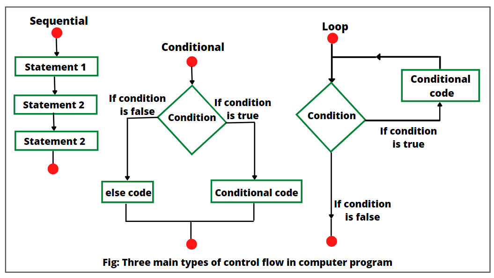

# Introducción

En lenguajes de programación, las estructuras de control permiten modificar el flujo de ejecución de las instrucciones de un programa.

Cuando las sentencias se ejecutan una tras otra tenemos un **flujo secuencial**. Cuando las sentencias que se ejecutan cambian dependiendo de alguna condición que se puede cumplir o no tenemos un **flujo condicional**. Cuando se repite la ejecución de una o varias sentencias tenemos un **flujo iterativo**.

<figure><figcaption>
Los tres principales flujos de ejecución
</figcaption></figure>

Cada estructura de control está diseñada para facilitar un tipo de flujo de ejecución:&#x20;

* ****[**Condicionales o de selección**](estructuras-de-control-condicional/): Sirven para expresar flujos condicionales
* ****[**Iterativas**](estructuras-de-control-iterativas/): Sirven para expresar flujos iterativos ****&#x20;
* ****[**De salto**](estructuras-de-control-de-salto/)**:** Se usan dentro de un flujo iterativo para modificar las iteraciones.

<figure><figcaption>
Clasificación de las principales estructuras de control
</figcaption></figure>

Los lenguajes de programación modernos tienen estructuras de control similares. Básicamente lo que varía entre las estructuras de control de los diferentes lenguajes es su sintaxis; cada lenguaje tiene una sintaxis propia para expresar la estructura.
