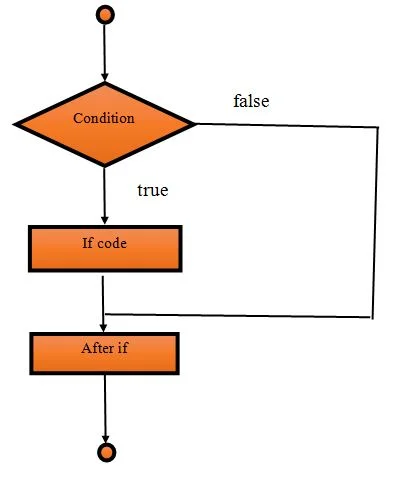
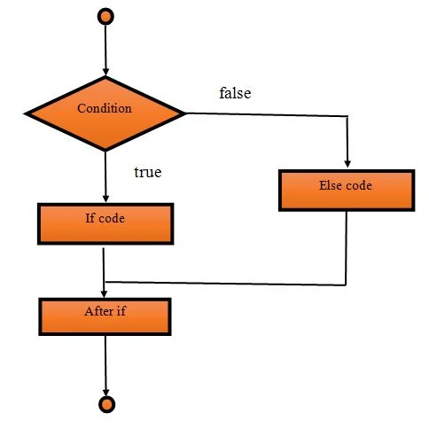
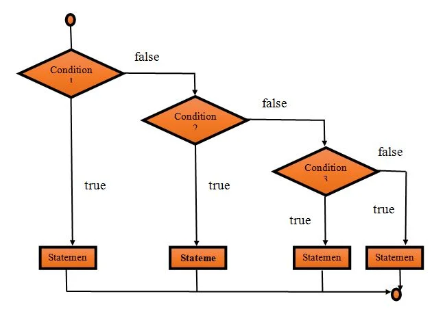

# If ... else if ... else

Se trata de la estructura de control más simple. Sirve para, en función de una o varias condiciones, decidir qué sentencias se deben ejecutar.

## If simple

La versión más simple de esta estructura de control consiste en utilizar una única claúsula `if` para decidir si un bloque de código se deben ejecutar o no. Un bloque de código es un conjunto de sentencias rodeadas por los símbolos `{` y `}`.

```java
if (condicion) {    
    // Aquí dentro se ponen las sentencias que se van a ejecutar si se cumple la
    // condición
}
```

<figure><figcaption></figcaption></figure>

Las condiciones van a ser expresiones que usan [operadores condicionales](../../ut01-introduccion-a-la-programacion/expresiones-y-operadores.md#operadores-condicionales).

Por ejemplo si tenemos dos números `x` e `y`, podemos mostrar en pantalla un mensaje cuando x es mayor que y.

```java
Scanner scanner = new Scanner(System.in);

System.out.println("Introduce un número");
int x = scanner.nextInt();
scanner.nextLine();

System.out.println("Introduce otro número");
int y = scanner.nextInt();
scanner.nextLine();
// La siguiente línea crea una claúsula if
if (x > y) {
    // Todas las sentencias que pongamos aquí se ejecutarán sólo si x es mayor que y
    System.out.println("x es mayor que y");
}

System.out.println("Esto se ejecuta siempre");
```

## If ... else

Además de la claúsula `if`, que es obligatoria, es posible añadir otra claúsula `else` que nos permite definir otro bloque de código que se ejecutará cuando la condición NO se cumpla.

```java
if (condicion) {
    // Aquí van las sentencias que se van a ejecutar si se cumple la condición
} else {
    // Aquí van las sentencias que se van a ejecutar si NO se cumple la condición
}
```

<figure><figcaption></figcaption></figure>

La claúsla **else no define ninguna condición**.

```java
Scanner scanner = new Scanner(System.in);

int x = scanner.nextInt();
scanner.nextLine();
int y = scanner.nextInt();
// La siguiente línea crea una claúsula if
if (x > y) {
    // Todas las sentencias que pongamos aquí se ejecutarán sólo si x es mayor que y
    System.out.println("x es mayor que y");
} else {
    // Todas las sentencias que pongamos aquí se ejecutarán sólo si x NO es mayor 
    // que y
    System.out.println("x no es mayor que y");
}
System.out.println("Esto se ejecuta siempre");
```

## If ... else if ... else

En ocasiones vamos a necesitar comprobar más de una condición para decidir si se ejecuta un bloque de código u otro. Para ello, podemos usar una claúsula `else if` por cada condición que queramos comprobar.

<pre class="language-java"><code class="lang-java">if (condicion1) {
    // Aquí van las sentencias que se van a ejecutar si se cumple condicion1
} else if (condición2) {
<strong>    // Aquí van las sentencias que se van a ejecutar si se cumplen ambas:
</strong><strong>    //      - NO se cumple condicion1
</strong><strong>    //      - Sí se cumple condicion2
</strong>} else {
    // Aquí van las sentencias que se van a ejecutar si NO se cumplen condicion1 
    // NI condición2
}
</code></pre>

<figure><figcaption><p>If (condition1) .... else if (condition2) .... else if (condition3) ... else</p></figcaption></figure>

A la hora de crear cláusulas `else if` se debe tener en cuenta que:

* Puede haber tantas cláusulas `else if` seguida como se desee.
* **Cada else `if` debe definir su propia condición**, distinta de las anteriores.
* Opcionalmente, se puede poner una **claúsula `else` después del último `else if`**.
* **No se pueden añadir cláusulas `else if` después de una claúsula `else`**.

```java
Scanner scanner = new Scanner(System.in);

int a = scanner.nextInt();
scanner.nextLine();
int b = scanner.nextInt();
// La siguiente línea crea una claúsula if
if (a > b) {
    // Todas las sentencias que pongamos aquí se ejecutarán sólo si a es mayor que b
    System.out.println("a es mayor que b");
} else if (a == b) {
    // Todas las sentencias que pongamos aquí se ejecutarán sólo si:
    //         a NO es mayor que b y a es igual que b
    System.out.println("a y b son iguales");
} else {
    // Todas las sentencias que pongamos aquí se ejecutarán sólo si:
    //        a NO es mayor que b y a NO es igual que b
    System.out.println("a es menor que b");
}

System.out.println("Esto se ejecuta siempre");
```

## If anidado

También es posible declarar un `if` dentro de otro, esto se denomina `if` anidado

```java
Scanner scanner = new Scanner(System.in);

int a = scanner.nextInt();
scanner.nextLine();
int b = scanner.nextInt();
// La siguiente línea crea una claúsula if
if (a > b) {
    // Esto es un if anidado
    if(a > 100) {
        System.out.println("a es mayor que 100");
    }
    // Todas las sentencias que pongamos aquí se ejecutarán sólo si a es mayor que b
    System.out.println("a es mayor que b");
} 
```
