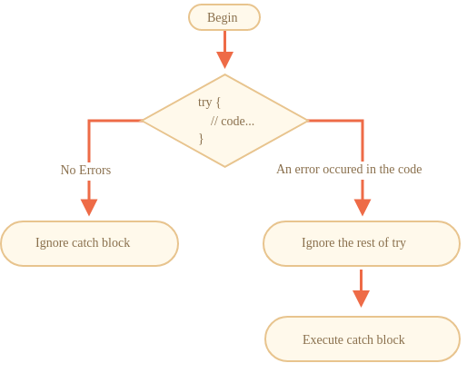

# Colecciones en Java

El lenguaje de programación Java incluye una extensa librería de estructuras de datos llamada Java Collections (colecciones Java).&#x20;

Cada tipo concreto de colección implementa una determinada estructura de datos que está optimizada para un conjunto determinado de operaciones.

Además, las colecciones se agrupan en **Tipos Abstractos de datos (ADTs por sus siglas en inglés)** que son interfaces genéricos que definen un conjunto de operaciones que se pueden realizar sobre una colección.

## Abstract Data Types (ADT)

<figure><figcaption>
Jerarquía de colecciones en Java
</figcaption></figure>

### List\<E>

Se caracterizan por almacenar datos de manera **secuencial**, es decir, en un orden determinado que no viene dado por el dato en sí sino por cómo han sido insertados en la colección.  En estas colecciones se **permite la repetición de elementos**. Su principal utilidad viene relacionada con datos en los que se quiere mantener un orden dado y/o puede haber repetición de datos.&#x20;

Por ejemplo, una lista de comentarios que se ha hecho en un post de Facebook, queremos que queden en el orden en el que se hicieron.

<figure><figcaption></figcaption></figure>

Algunas de las características de los List son:

* Sirven para almacenar datos secuenciales
* Permiten la repetición de datos
* Cada instancia de un List define el tipo de valores que almacena a través del parámetro de tipo E.
* Sirven para almacenar secuencias de datos, en las que se desea poder modificar el orden de los elementos libremente.&#x20;

### Set\<E>

Las colecciones de tipo Set representan conjuntos de datos. No es posible definir el orden (o secuencia) en el que se encuentran dichos datos dentro de la colección sino que viene predefinida dependiendo de la misma)

<figure><figcaption>
Un set es un conjunto de valores no secuenciales
</figcaption></figure>

Algunas de las características de los Set son:

* Sirven para almacenar **datos no secuenciales**. &#x20;
* Cada instancia de un Set define el tipo de valores que almacena a través del parámetro de tipo E.&#x20;
* No es posible almacenar elementos repetidos.&#x20;
* Son colecciones optimizadas para buscar datos de forma eficiente.&#x20;
* Al no ser una secuencia, los elementos que alberga no tienen una posición (o índice) asociada.
* La ordenación interna de los datos depende del tipo de Set

### Map\<K, V>

Los mapas son colecciones asociativas, que permiten almacenar clave-valor. Al igual que los Set, representan conjuntos de valores no secuenciales, es decir no se puede establecer una ordenación.

<figure><figcaption>
Mapa que relaciona códigos de estado con su nombre
</figcaption></figure>

Algunas características de los mapas son:

* Son colecciones que permiten asociar pares de valores (clave y valor)
* No puede haber dos pares con la misma clave.
* Cada instancia de Map define el tipo de las claves (K) y el tipo de los valores (V).
* Estas colecciones están optimizadas para la realización de búsquedas por la clave.

### Queue\<E> (colas)

Una cola, también conocida como "queue" en inglés, es una colección ordenada de elementos que sigue el principio FIFO (First In, First Out), es decir, el primer elemento que se inserta en la cola es el primero en ser eliminado. Esto se asemeja a una fila en la vida real, donde la primera persona en llegar a la fila es la primera en ser atendida y salir.

<figure><figcaption></figcaption></figure>

Las colas son útiles en una variedad de situaciones, incluyendo la gestión de tareas en sistemas de procesamiento, la implementación de algoritmos de búsqueda y la gestión de recursos compartidos. Aquí hay algunos usos comunes de las colas:

1. **Procesamiento de tareas en lotes (batch processing)**: Las colas son útiles para manejar tareas en lotes, donde las tareas se agregan a la cola en el orden en que llegan y luego se procesan en ese mismo orden.
2. **Gestión de solicitudes en servidores**: Los servidores web y otros sistemas de red a menudo utilizan colas para gestionar las solicitudes de los clientes. Las solicitudes se colocan en la cola en el orden en que se reciben y luego se procesan por el servidor de acuerdo con su disponibilidad.
3. **Planificación de procesos en sistemas operativos**: En los sistemas operativos, las colas de procesos se utilizan para planificar la ejecución de programas y tareas. Los procesos se agregan a la cola de acuerdo con su prioridad y se ejecutan en el orden correspondiente.

### Stack\<E>

Una pila es una estructura de datos lineal que sigue el principio de "último en entrar, primero en salir" (LIFO, por sus siglas en inglés: Last In, First Out). Esto significa que el último elemento que se inserta en la pila es el primero en ser eliminado. En una pila, los elementos se agregan y eliminan solo desde un extremo, comúnmente conocido como la cima (top) de la pila.

<figure><figcaption></figcaption></figure>

La estructura de pila se puede visualizar como una pila de platos, donde solo puedes agregar o quitar platos desde la parte superior de la pila. Los elementos que se colocan en la pila se mantienen en su lugar hasta que se elimina el elemento superior.

Las pilas se utilizan en una variedad de aplicaciones y escenarios, incluyendo:

1. **Gestión de llamadas a funciones (call stack)**: En la programación, las pilas se utilizan para administrar las llamadas a funciones y la ejecución de instrucciones. Cada vez que se llama a una función, se agrega un marco de pila que contiene información sobre la función actual y sus variables locales. Cuando la función termina, su marco de pila se elimina y se regresa al contexto anterior.
2. **Implementación de algoritmos recursivos**: Los algoritmos recursivos a menudo se implementan utilizando pilas. Cada vez que se realiza una llamada recursiva, se agrega un marco de pila que contiene información sobre la llamada actual. Esto permite que las llamadas recursivas se resuelvan en el orden correcto y evita el desbordamiento del programa.
3. **Inversión de elementos (reverse)**: Las pilas se pueden utilizar para invertir el orden de los elementos. Al agregar elementos a una pila y luego eliminarlos, los elementos se recuperan en orden inverso al que se agregaron originalmente.
4. **Historial de navegación en navegadores web**: Los navegadores web utilizan pilas para realizar un seguimiento del historial de navegación del usuario. Cada vez que se visita una página web, se agrega a la pila de historial. Cuando se hace clic en el botón "atrás", se elimina la página superior de la pila, lo que permite al usuario retroceder a la página anterior.
